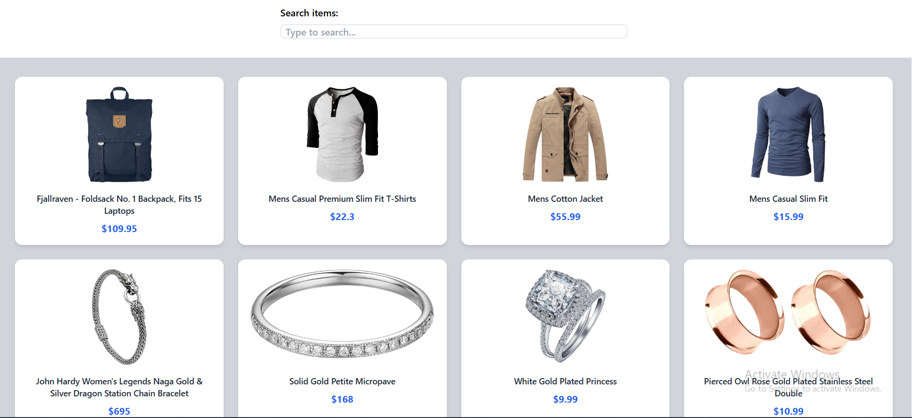

Fake Store Product Grid

A simple web page that fetches products from Fake Store API and shows them as cards. You can search for products, and matching words are highlighted.

Features

Fetches products from Fake Store API

Responsive card layout with Tailwind CSS

Real-time search with highlights

How to Use

Open index.html in a browser

Products load automatically

Type in the search bar to filter products

Files

index.html – HTML page

index.js – JavaScript for fetching, rendering, and searching